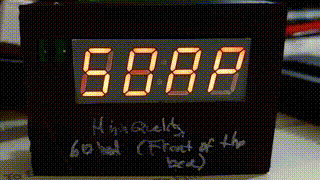

# License

The project is under Attribution-ShareAlike 4.0 International (CC BY-SA 4.0).

# Libraries used for this project

 - adafruit
 - darnok\_common (https://github.com/konradwilk/eagle-libraries.git)
 - darnok\_led (https://github.com/konradwilk/eagle-libraries.git)
 - darnok\_usb (https://github.com/konradwilk/eagle-libraries.git)
 - darnok\_sensors (https://github.com/konradwilk/eagle-libraries.git)
 - darnok\_microsd (https://github.com/konradwilk/eagle-libraries.git)
 - darnok\_4050 (https://github.com/konradwilk/eagle-libraries.git)
 - SparkFun-Aesthetics
 - SparkFun-Capacitors
 - SparkFun-Connectors
 - SparkFun-Hardware
 - SparkFun-IC-Microcontroller
 - SparkFun-IC-Power
 - SparkFun-Jumpers
 - Serial-Basic (https://github.com/sparkfun/Serial_Basic_Breakout-CH340G.git)

# Purpose

Quite simply it is to have a count-down timer for 20 seconds for washing hands.
It is activated by a line sensor (which has infrared light) that plugs in the board.

</img>

Video (speed up) of text printed.

# PCB

The _main_ branch is for development and changes often.
The <a href="Wash_Hand.pdf">Wash Hand</a> Board and Schematic are available.

## Prior versions

There are various branches, see:

 - <a href="https://github.com/konradwilk/wash-hand-pcb/tree/stable-1.3-tqfp">stable-1.3-tqfp</a>
 - <a href="https://github.com/konradwilk/wash-hand-pcb/tree/stable-1.3-dip28">stable-1.3-dip28</a>
 - <a href="https://github.com/konradwilk/wash-hand-pcb/tree/stable-1.2-dip28">stable-1.2-dip28</a>

# Future plans for software

In particular order:

 - Fetch data from a SD-card (if attached), otherwise read from EEPROM (1K).
 - Format-type of the data type for above mechanism.
 - Utilize sleep operations to keep the CPU most of the time asleep.
 - Utilize modulo for the numbers.
