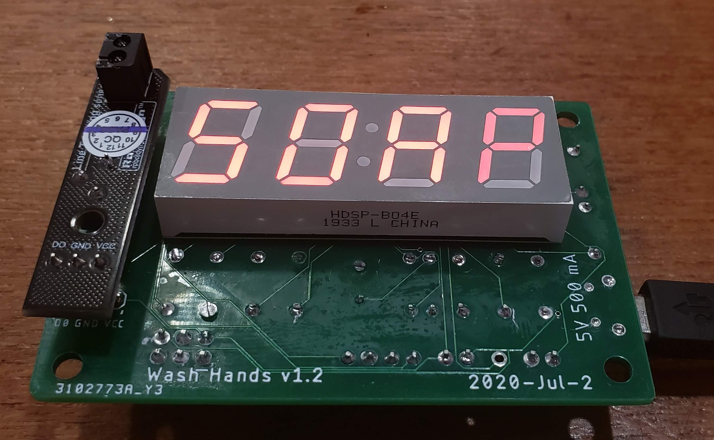
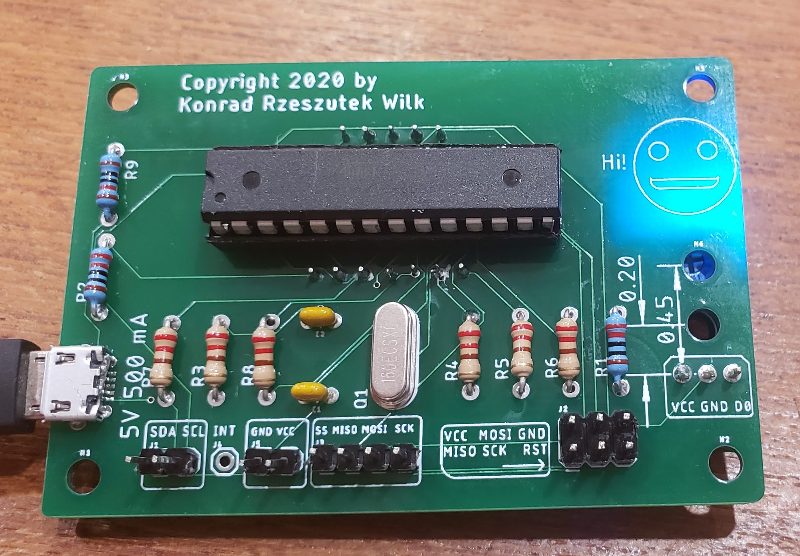
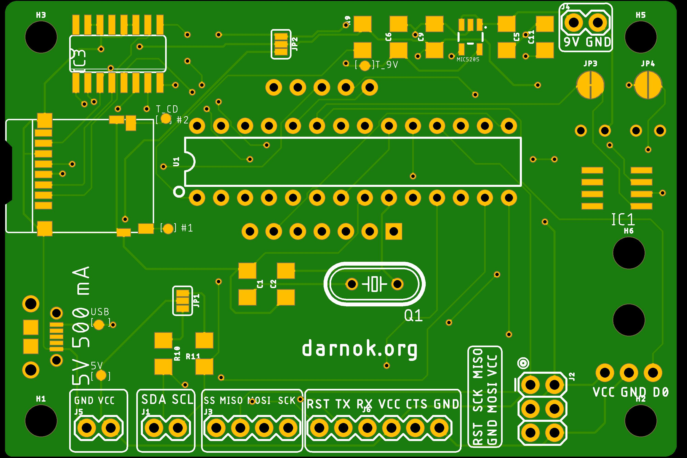
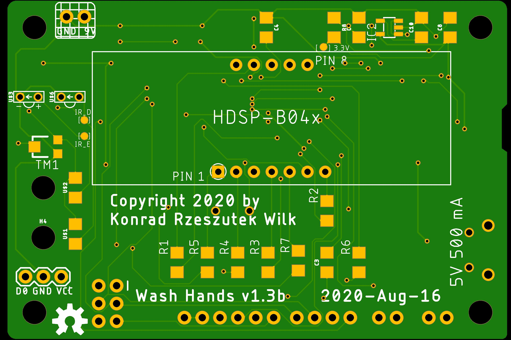
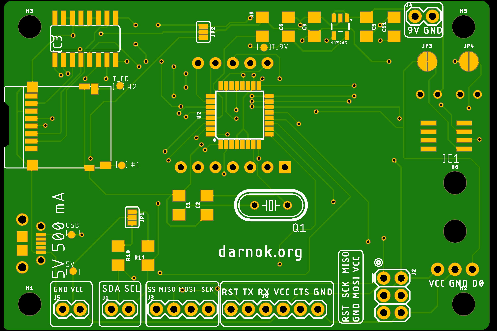

# License

The project is under Attribution-ShareAlike 4.0 International (CC BY-SA 4.0).

# Libraries used for this project

 - adafruit
 - darnok\_common (https://github.com/konradwilk/eagle-libraries.git)
 - darnok\_led (https://github.com/konradwilk/eagle-libraries.git)
 - darnok\_usb (https://github.com/konradwilk/eagle-libraries.git)
 - darnok\_sensors (https://github.com/konradwilk/eagle-libraries.git)
 - darnok\_microsd (https://github.com/konradwilk/eagle-libraries.git)
 - SparkFun-Aesthetics
 - SparkFun-Capacitors
 - SparkFun-Connectors
 - SparkFun-Hardware
 - SparkFun-IC-Microcontroller
 - SparkFun-IC-Power
 - SparkFun-Jumpers

# Purpose

Quite simply it is to have a count-down timer for 20 seconds for washing hands.
It is activated by a line sensor (which has infrared light) that plugs in the board.

## PCB v1.2-routing

The v1.2-routing is the stable release.  See the <a href="BOM.txt">BOM</a> for the list of materials.
Note the missing line sensor which was <a href="https://www.aliexpress.com/item/32654587628.html">on AliExpress</a>

</img>
</img>

Note that the routing was done automatically with slight adjustments whenever the Design Rule Check did not
like it.

## PCB v1.3

Like v1.2, but has:

 - Reworked connectors for programming via FTDI USB,
 - Built in line sensor,
 - Built in SD card for various texts,
 - SMD resistors and capacitors,
 - Test points,
 - 9V or 5V USB power option.

See the <a href="Wash_Hand_v1.3.pdf">Board/Schematic</a> . The <a href="BOM-1.3.txt">BOM</a> for the list of materials.

</img>
</img>

And the data sheets are in <a href="Datasheets">Datasheets</a> directory.

## PCB v1.3

Like v1.3, but has:

 - ATMEGA328P TQFP

</img>
</img>

# Future plans for software

In particular order:

 - Fetch data from a SD-card (if attached), otherwise read from EEPROM (1K).
 - Format-type of the data type for above mechanism.
 - Utilize sleep operations to keep the CPU most of the time asleep.
 - Utilize modulo for the numbers.
