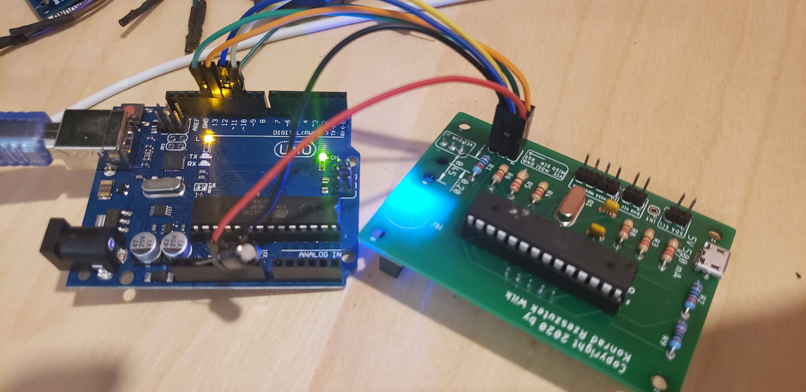

# Notes on v1.2

- Missing PIN1 label on the ICSP header.
- The ICSP header should be turned 90
- Holes for the LED are mighty small
- No 0.1 uF between pin 7,8 and 20,22
- Putting in a ATMEGA328P from a Uno works, but programming via SPI no go.
- The software had D1,D2,D3,D4 in the wrong order. Reversing fixed it.

## Programming with SPI

We get:
<pre>

/Users/konrad/Library/Arduino15/packages/arduino/tools/avrdude/6.3.0-arduino17/bin/avrdude -C/Users/konrad/Library/Arduino15/packages/arduino/tools/avrdude/6.3.0-arduino17/etc/avrdude.conf -v -patmega328p -carduino -P/dev/cu.usbmodem14131 -b57600 -D -Uflash:w:/var/folders/h2/52kr6qls6ks84xkqghm6vp4m0000gn/T/arduino_build_794064/Wash_Hand.ino.hex:i 

avrdude: Version 6.3-20190619
         Copyright (c) 2000-2005 Brian Dean, http://www.bdmicro.com/
         Copyright (c) 2007-2014 Joerg Wunsch

         System wide configuration file is "/Users/konrad/Library/Arduino15/packages/arduino/tools/avrdude/6.3.0-arduino17/etc/avrdude.conf"
         User configuration file is "/Users/konrad/.avrduderc"
         User configuration file does not exist or is not a regular file, skipping

         Using Port                    : /dev/cu.usbmodem14131
         Using Programmer              : arduino
         Overriding Baud Rate          : 57600
avrdude: stk500_recv(): programmer is not responding
avrdude: stk500_getsync() attempt 1 of 10: not in sync: resp=0x00
avrdude: stk500_getsync() attempt 2 of 10: not in sync: resp=0x1c
avrdude: stk500_getsync() attempt 3 of 10: not in sync: resp=0x1c
avrdude: stk500_getsync() attempt 4 of 10: not in sync: resp=0x1c
avrdude: stk500_getsync() attempt 5 of 10: not in sync: resp=0x1c
avrdude: stk500_getsync() attempt 6 of 10: not in sync: resp=0x1c
avrdude: stk500_getsync() attempt 7 of 10: not in sync: resp=0x1c
avrdude: stk500_getsync() attempt 8 of 10: not in sync: resp=0x1c
avrdude: stk500_getsync() attempt 9 of 10: not in sync: resp=0x1c
avrdude: stk500_getsync() attempt 10 of 10: not in sync: resp=0x1c

avrdude done.  Thank you.
</pre>

with this setup:

</img>

The "target" board has the ArduinoISP sketch loaded and a capacitor so it does not reset.

The Programmer is _ArduinoISP_

The Board type is set to be _Arduino Pro Mini_.

The idea is that I would expect the Uploading of my sketch to the "target" board

But sadly not working.

## Details

# Board detector

From http://www.gammon.com.au/forum/?id=11637 it hinted at using the 
Arduino chip detector to make sure the communication is good.

Specifically used https://github.com/nickgammon/arduino_sketches
board detector which detects this to be a happy board:

<pre>
Atmega chip detector.
Written by Nick Gammon.
Version 1.20
Compiled on Jul 27 2020 at 21:08:27 with Arduino IDE 10812.
Attempting to enter ICSP programming mode ...
Entered programming mode OK.
Signature = 0x1E 0x95 0x0F 
Processor = ATmega328P
Flash memory size = 32768 bytes.
LFuse = 0xFF 
HFuse = 0xDE 
EFuse = 0xFD 
Lock byte = 0xCF 
Clock calibration = 0xAF 
Bootloader in use: Yes
EEPROM preserved through erase: No
Watchdog timer always on: No
Bootloader is 512 bytes starting at 7E00

Bootloader:

7E00: 0x11 0x24 0x84 0xB7 0x14 0xBE 0x81 0xFF 0xF0 0xD0 0x85 0xE0 0x80 0x93 0x81 0x00 
7E10: 0x82 0xE0 0x80 0x93 0xC0 0x00 0x88 0xE1 0x80 0x93 0xC1 0x00 0x86 0xE0 0x80 0x93 
7E20: 0xC2 0x00 0x80 0xE1 0x80 0x93 0xC4 0x00 0x8E 0xE0 0xC9 0xD0 0x25 0x9A 0x86 0xE0 
7E30: 0x20 0xE3 0x3C 0xEF 0x91 0xE0 0x30 0x93 0x85 0x00 0x20 0x93 0x84 0x00 0x96 0xBB 
7E40: 0xB0 0x9B 0xFE 0xCF 0x1D 0x9A 0xA8 0x95 0x81 0x50 0xA9 0xF7 0xCC 0x24 0xDD 0x24 
7E50: 0x88 0x24 0x83 0x94 0xB5 0xE0 0xAB 0x2E 0xA1 0xE1 0x9A 0x2E 0xF3 0xE0 0xBF 0x2E 
7E60: 0xA2 0xD0 0x81 0x34 0x61 0xF4 0x9F 0xD0 0x08 0x2F 0xAF 0xD0 0x02 0x38 0x11 0xF0 
7E70: 0x01 0x38 0x11 0xF4 0x84 0xE0 0x01 0xC0 0x83 0xE0 0x8D 0xD0 0x89 0xC0 0x82 0x34 
7E80: 0x11 0xF4 0x84 0xE1 0x03 0xC0 0x85 0x34 0x19 0xF4 0x85 0xE0 0xA6 0xD0 0x80 0xC0 
7E90: 0x85 0x35 0x79 0xF4 0x88 0xD0 0xE8 0x2E 0xFF 0x24 0x85 0xD0 0x08 0x2F 0x10 0xE0 
7EA0: 0x10 0x2F 0x00 0x27 0x0E 0x29 0x1F 0x29 0x00 0x0F 0x11 0x1F 0x8E 0xD0 0x68 0x01 
7EB0: 0x6F 0xC0 0x86 0x35 0x21 0xF4 0x84 0xE0 0x90 0xD0 0x80 0xE0 0xDE 0xCF 0x84 0x36 
7EC0: 0x09 0xF0 0x40 0xC0 0x70 0xD0 0x6F 0xD0 0x08 0x2F 0x6D 0xD0 0x80 0xE0 0xC8 0x16 
7ED0: 0x80 0xE7 0xD8 0x06 0x18 0xF4 0xF6 0x01 0xB7 0xBE 0xE8 0x95 0xC0 0xE0 0xD1 0xE0 
7EE0: 0x62 0xD0 0x89 0x93 0x0C 0x17 0xE1 0xF7 0xF0 0xE0 0xCF 0x16 0xF0 0xE7 0xDF 0x06 
7EF0: 0x18 0xF0 0xF6 0x01 0xB7 0xBE 0xE8 0x95 0x68 0xD0 0x07 0xB6 0x00 0xFC 0xFD 0xCF 
7F00: 0xA6 0x01 0xA0 0xE0 0xB1 0xE0 0x2C 0x91 0x30 0xE0 0x11 0x96 0x8C 0x91 0x11 0x97 
7F10: 0x90 0xE0 0x98 0x2F 0x88 0x27 0x82 0x2B 0x93 0x2B 0x12 0x96 0xFA 0x01 0x0C 0x01 
7F20: 0x87 0xBE 0xE8 0x95 0x11 0x24 0x4E 0x5F 0x5F 0x4F 0xF1 0xE0 0xA0 0x38 0xBF 0x07 
7F30: 0x51 0xF7 0xF6 0x01 0xA7 0xBE 0xE8 0x95 0x07 0xB6 0x00 0xFC 0xFD 0xCF 0x97 0xBE 
7F40: 0xE8 0x95 0x26 0xC0 0x84 0x37 0xB1 0xF4 0x2E 0xD0 0x2D 0xD0 0xF8 0x2E 0x2B 0xD0 
7F50: 0x3C 0xD0 0xF6 0x01 0xEF 0x2C 0x8F 0x01 0x0F 0x5F 0x1F 0x4F 0x84 0x91 0x1B 0xD0 
7F60: 0xEA 0x94 0xF8 0x01 0xC1 0xF7 0x08 0x94 0xC1 0x1C 0xD1 0x1C 0xFA 0x94 0xCF 0x0C 
7F70: 0xD1 0x1C 0x0E 0xC0 0x85 0x37 0x39 0xF4 0x28 0xD0 0x8E 0xE1 0x0C 0xD0 0x85 0xE9 
7F80: 0x0A 0xD0 0x8F 0xE0 0x7A 0xCF 0x81 0x35 0x11 0xF4 0x88 0xE0 0x18 0xD0 0x1D 0xD0 
7F90: 0x80 0xE1 0x01 0xD0 0x65 0xCF 0x98 0x2F 0x80 0x91 0xC0 0x00 0x85 0xFF 0xFC 0xCF 
7FA0: 0x90 0x93 0xC6 0x00 0x08 0x95 0x80 0x91 0xC0 0x00 0x87 0xFF 0xFC 0xCF 0x80 0x91 
7FB0: 0xC0 0x00 0x84 0xFD 0x01 0xC0 0xA8 0x95 0x80 0x91 0xC6 0x00 0x08 0x95 0xE0 0xE6 
7FC0: 0xF0 0xE0 0x98 0xE1 0x90 0x83 0x80 0x83 0x08 0x95 0xED 0xDF 0x80 0x32 0x19 0xF0 
7FD0: 0x88 0xE0 0xF5 0xDF 0xFF 0xCF 0x84 0xE1 0xDE 0xCF 0x1F 0x93 0x18 0x2F 0xE3 0xDF 
7FE0: 0x11 0x50 0xE9 0xF7 0xF2 0xDF 0x1F 0x91 0x08 0x95 0x80 0xE0 0xE8 0xDF 0xEE 0x27 
7FF0: 0xFF 0x27 0x09 0x94 0xFF 0xFF 0xFF 0xFF 0xFF 0xFF 0xFF 0xFF 0xFF 0xFF 0x04 0x04 

MD5 sum of bootloader = 0xFB 0xF4 0x9B 0x7B 0x59 0x73 0x7F 0x65 0xE8 0xD0 0xF8 0xA5 0x08 0x12 0xE7 0x9F 
Bootloader name: optiboot_atmega328

First 256 bytes of program memory:

00: 0x0C 0x94 0x5C 0x00 0x0C 0x94 0x79 0x00 0x0C 0x94 0x79 0x00 0x0C 0x94 0x79 0x00 
10: 0x0C 0x94 0x79 0x00 0x0C 0x94 0x79 0x00 0x0C 0x94 0x79 0x00 0x0C 0x94 0x79 0x00 
20: 0x0C 0x94 0x79 0x00 0x0C 0x94 0x79 0x00 0x0C 0x94 0x79 0x00 0x0C 0x94 0x79 0x00 
30: 0x0C 0x94 0x79 0x00 0x0C 0x94 0x79 0x00 0x0C 0x94 0x79 0x00 0x0C 0x94 0x79 0x00 
40: 0x0C 0x94 0x33 0x02 0x0C 0x94 0x79 0x00 0x0C 0x94 0x79 0x00 0x0C 0x94 0x79 0x00 
50: 0x0C 0x94 0x79 0x00 0x0C 0x94 0x79 0x00 0x0C 0x94 0x79 0x00 0x0C 0x94 0x79 0x00 
60: 0x0C 0x94 0x79 0x00 0x0C 0x94 0x79 0x00 0x00 0x00 0x00 0x08 0x00 0x02 0x01 0x00 
70: 0x00 0x03 0x04 0x07 0x00 0x00 0x00 0x00 0x00 0x00 0x00 0x00 0x00 0x00 0x00 0x00 
80: 0x25 0x00 0x28 0x00 0x2B 0x00 0x00 0x00 0x00 0x00 0x24 0x00 0x27 0x00 0x2A 0x00 
90: 0x04 0x04 0x04 0x04 0x04 0x04 0x04 0x04 0x02 0x02 0x02 0x02 0x02 0x02 0x03 0x03 
A0: 0x03 0x03 0x03 0x03 0x01 0x02 0x04 0x08 0x10 0x20 0x40 0x80 0x01 0x02 0x04 0x08 
B0: 0x10 0x20 0x01 0x02 0x04 0x08 0x10 0x20 0x11 0x24 0x1F 0xBE 0xCF 0xEF 0xD8 0xE0 
C0: 0xDE 0xBF 0xCD 0xBF 0x11 0xE0 0xA0 0xE0 0xB1 0xE0 0xE8 0xE5 0xF7 0xE0 0x02 0xC0 
D0: 0x05 0x90 0x0D 0x92 0xA2 0x37 0xB1 0x07 0xD9 0xF7 0x21 0xE0 0xA2 0xE7 0xB1 0xE0 
E0: 0x01 0xC0 0x1D 0x92 0xAF 0x37 0xB2 0x07 0xE1 0xF7 0x0E 0x94 0x7D 0x02 0x0C 0x94 
F0: 0xAA 0x03 0x0C 0x94 0x00 0x00 0x90 0xE0 0xFC 0x01 0xEC 0x55 0xFF 0x4F 0x24 0x91 

Programming mode off.

</pre>

## Chip Programming Output

Also used the Chip Programming one just to make sure the SPI is good.

<pre>
Atmega chip programmer.
Written by Nick Gammon.
Version 1.38
Compiled on Jul 27 2020 at 21:16:28 with Arduino IDE 10812.
Attempting to enter ICSP programming mode ...
Entered programming mode OK.
Signature = 0x1E 0x95 0x0F 
Processor = ATmega328P
Flash memory size = 32768 bytes.
LFuse = 0xFF 
HFuse = 0xDE 
EFuse = 0xFD 
Lock byte = 0xCF 
Clock calibration = 0xAF 
Type 'L' to use Lilypad (8 MHz) loader, or 'U' for Uno (16 MHz) loader ...
Using Uno Optiboot 16 MHz loader.
Bootloader address = 0x7E00
Bootloader length = 512 bytes.
Type 'Q' to quit, 'V' to verify, or 'G' to program the chip with the bootloader ...
Verifying ...
No errors found.
Done.
Programming mode off.
Type 'C' when ready to continue with another chip ...
Attempting to enter ICSP programming mode ...
Entered programming mode OK.
Signature = 0x1E 0x95 0x0F 
Processor = ATmega328P
Flash memory size = 32768 bytes.
LFuse = 0xFF 
HFuse = 0xDE 
EFuse = 0xFD 
Lock byte = 0xCF 
Clock calibration = 0xAF 
Type 'L' to use Lilypad (8 MHz) loader, or 'U' for Uno (16 MHz) loader ...
Using Uno Optiboot 16 MHz loader.
Bootloader address = 0x7E00
Bootloader length = 512 bytes.
Type 'Q' to quit, 'V' to verify, or 'G' to program the chip with the bootloader ...
Erasing chip ...
Writing bootloader ...
Committing page starting at 0x7E00
Committing page starting at 0x7E80
Committing page starting at 0x7F00
Committing page starting at 0x7F80
Written.
Verifying ...
No errors found.
Writing fuses ...
LFuse = 0xFF 
HFuse = 0xDE 
EFuse = 0xFD 
Lock byte = 0xEF 
Clock calibration = 0xAF 
Done.
Programming mode off.
Type 'C' when ready to continue with another chip ...
</pre>

All good from that perspective, but still I cannot upload the sketch!

